# Features

A walkthrough of what the hub does and the reasoning behind the
behaviour. For the technical internals (database, time handling,
logging), see [architecture.md](architecture.md).

## First run

A hub with an empty database offers to create the first account right in the browser — that account becomes the administrator. Passwords are never printed to server logs.

Family members are added with invitations: the administrator creates a single-use link (valid for a week, shown once, stored as a hash), the person opens it and fills in their own name, login and password. This is the only way in — for a kid without their own device, the parent simply opens the link themselves. Each joining member automatically gets a distinct account color (the avatar is the first letter of the name, so color is what tells people apart).

Day-to-day work happens under personal accounts. The administrator role manages the system; it has **no access to other people's private notes** — private queries filter by owner, and there is no "if admin, show everything" branch in the code.

### Lost password

```bash
npm run admin:reset                      # for the administrator
npm run admin:reset -- name@hub.local    # for a specific account
```

In Docker: `docker compose exec app node scripts/admin-reset.mjs`

It issues a new password, requires changing it on first sign-in and closes all previous sessions. Before this existed, the only way out of a lost password was deleting the database — losing everything.

**On a hosted hub there is a reset link on the sign-in screen instead — for a confirmed address.** The distinction is not arbitrary: whoever runs the machine has a stronger door than any email flow — a shell, and a script that cannot be reached from the internet — while a family on the service has no shell at all, so a forgotten password would otherwise be somebody else's support ticket. The emailed link works once, for an hour, and is stored hashed. Two things it deliberately does not do: it never says whether an address has an account here (the answer is the same either way, on a service that also refuses to confirm which families exist), and it changes the password only — the second factor stays on, so a mailbox is not a way around it, and a member who turned password sign-in off does not get it turned back on behind their back.

The address has to be confirmed first, and that is not bureaucracy. The login has always been an address in shape only — nothing proved ownership, and a self-hosted hub may legitimately use a fictional one — which was harmless while it was just an identifier. It stops being harmless the moment a forgotten password can be recovered through it: a typo at signup would mail a working link to a stranger. So a hosted hub sends a confirmation when the account is created, shows a reminder until it is used, and refuses to mail a reset to an unconfirmed address. If the address itself was wrong, the administrator can move the account to another one (Settings → the member) — the new address starts unconfirmed, because the proof belonged to the address and not to the account.

## Signing in

Two ways in: password and Google. An account is **never** created via Google: the hub is a family tool, the household is known, a stranger's Google account is refused at the door. Google is linked by an explicit action in Settings, from a live session, and is identified by the account's permanent ID rather than the email address — the email can change, the link survives.

Once linked, password sign-in can be disabled per account in Settings: Google with its protections (prompts, passkeys) guards the entrance better than any password. The mode is invisible from outside — a disabled password answers the same "Wrong login or password" as a merely wrong one, with the same response time.

On the hosted service Google sign-in works the same way from the outside, through one shared return address; the mechanics are in [architecture.md](architecture.md#hosted-mode).

One invariant always holds: **the administrator's password sign-in cannot be disabled**. It is the emergency door — if a Google account is hijacked, blocked, or Google itself is down, the administrator signs in with the password and restores access by resetting passwords (a reset also re-enables password sign-in). A hub whose only way in runs through an external service is a hub that will one day refuse to open.

An emergency door deserves a second lock: any account can enable **two-factor authentication** (Settings → Two-factor authentication) — a six-digit TOTP code from an authenticator app, required at password sign-in on top of the password. It matters most for the administrator, whose password entrance can never be turned off; family members usually hide behind Google and its own protections instead. Google sign-in is unaffected by the hub's TOTP. Lost authenticator: `npm run admin:reset` clears the second factor together with the password — the escape hatch stays the server owner's console, never a web page.

A code is spent when it is used, as the "one-time" in one-time password promises: the hub records which 30-second step it accepted and refuses that one and every earlier one afterwards. In practice that shows up once — signing in on a second device inside the same half-minute waits for the next code. That is the cost of a code being worthless to anyone who reads it over your shoulder after you have used it.

Settings also shows **Devices** — every live session with browser, IP and last activity, the current one marked. Any session can be revoked individually, or all but the current one at once ("Sign out everywhere else" — the lost-phone button). A revoked device also clears its offline copy of the data the next time it touches the network. Sessions idle for a month retire on their own.

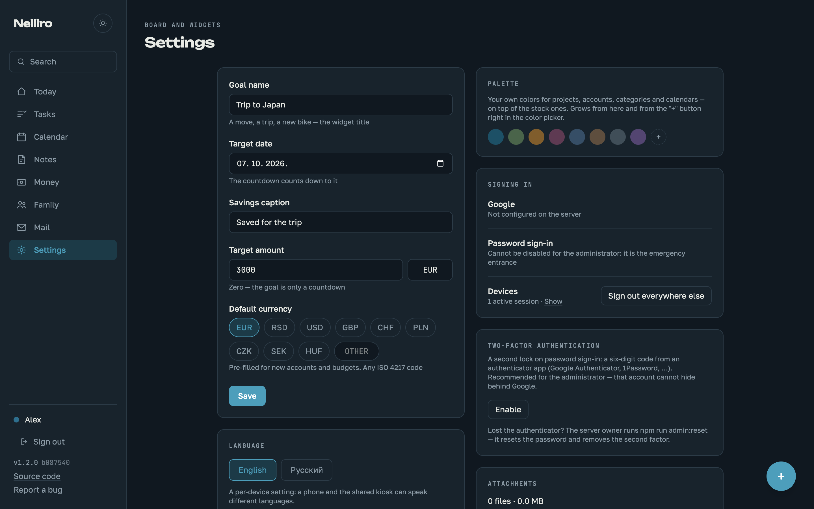

Setting up Google sign-in on a server: [deploy-vps.md](deploy-vps.md), "Google sign-in".

## Tasks

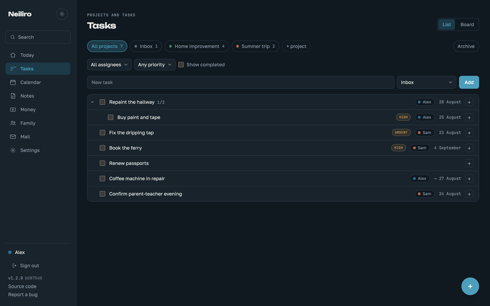

Three nesting levels: story → task → subtask. The server refuses anything deeper, deliberately — otherwise the tree turns into a dump.

A task carries two dates. **Due date** is when it should be done; **expected finish** is when it is realistically going to be done. When the expected finish is set, it takes over everywhere a date matters: overdue is counted from it, and the dashboard and calendar place the task on that day. The scenario it exists for: a coffee machine goes in for a week-long repair — the task is in progress and on plan, not "overdue" for seven days straight. In lists the stand-in date is marked with an arrow (`→ 21 August`). The expected finish belongs to one specific occurrence, so a recurring task's next occurrence never inherits it.

Recurrence uses a subset of RRULE: `FREQ=MONTHLY;INTERVAL=1` and the like. The next date is computed **from the series anchor**, not from the previous occurrence. Otherwise "every 31st" would slip to the 28th forever after February.

Task order is accepted as a full list of IDs (`POST /api/tasks/reorder`) rather than fractional positions between neighbours. At household scale rewriting fifty rows costs nothing, and positions never degrade over time.

`Cmd/Ctrl + K` opens quick-add from any section. A task with no project selected goes to the Inbox.

## Notes

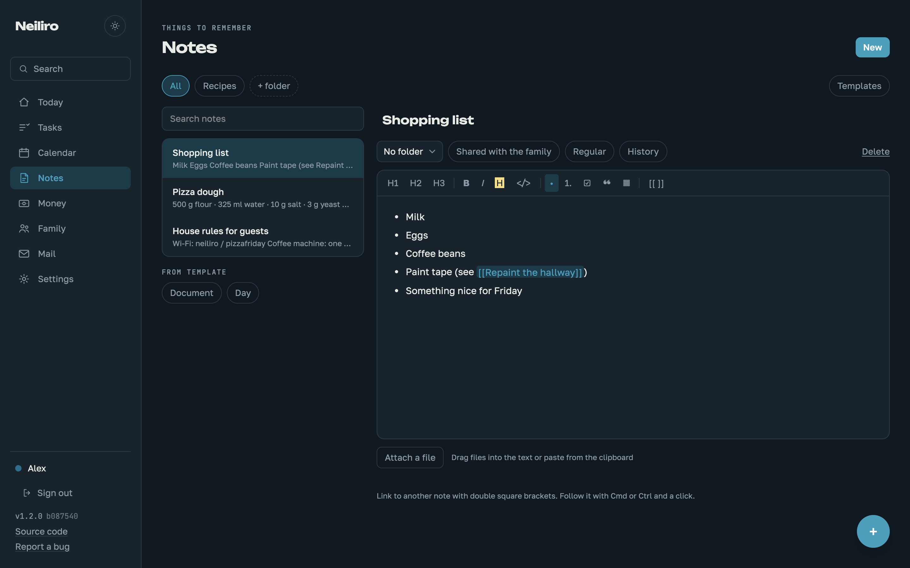

Stored as markdown. The editor is TipTap, but what lands on disk is plain markdown, readable in any text editor.

A link to another note is `[[Title]]`. It is implemented as a decoration over plain text, not a separate schema node: the note stays valid markdown, and a link to a note that does not exist yet is kept "dangling" and picks itself up when a note with that title appears.

Version history is not written on every save — autosave would produce a thousand rows in an evening. A snapshot is taken if more than ten minutes passed since the last one, or if a different person is editing. A rollback also lands in history, so it is reversible.

Templates are ordinary notes with a flag: any note can become a template and back. They stay out of the main list and are offered when creating a new note. A private template follows the same rules as a private note: only its owner can expand it. Placeholders `{{date}}`, `{{time}}`, `{{author}}` and `{{iso}}` work in both body and title; they expand once, at creation time, and become plain text. An unknown key is left as-is — a typo never eats content.

A private note is visible only to its owner — in lists, in search, and by direct link. The administrator is no exception. The daily note included: if a private note by someone else already exists for a date, the second person gets an honest refusal, not its content — a second note for the same date cannot exist, the daily date is unique.

### Attachments

Files go to the data directory under `attachments/YYYY-MM/` with generated names; the original name is kept in the database. A human-supplied name never becomes part of a disk path — otherwise `../../` in a name would write anywhere.

The per-file ceiling is 50 MB, and the store as a whole has a 2 GB budget: Settings shows how much is used, and once the budget is exhausted new uploads are refused rather than draining the disk. Usage is available at `GET /api/attachments/usage`.

Files can be dragged straight into note text or pasted from the clipboard. Images land at the drop point and enter the markdown as regular images; other files simply attach.

An attachment is visible to whoever can see the note. Deleting a note removes the files from disk, not just the rows.

## Calendar

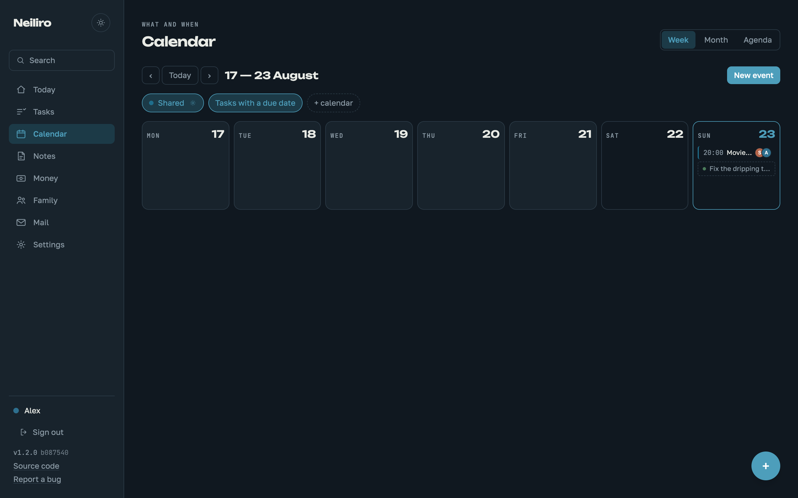

Time is stored as local wall-clock time, not UTC. "Every Tuesday at 10:00" must stay at 10:00 after a clock change; storing UTC would force recalculating every series occurrence through DST rules. A household lives in one time zone, and names it in Settings → Time zone.

Recurring events expand on the fly per requested range and are never materialised into the database: "every year" with no end date is an infinite table. A single occurrence can be cancelled without touching the series; cancelled dates are kept as an exception list.

Event participants ("who is going") show as circles with the first letter of the name — in the grid, the agenda and the dashboard. Without that, picking participants produced no visible result and looked broken.

A calendar is either shared (visible to all) or personal (visible only to the owner, administrator included). The set of visible layers and the chosen view are remembered per device: a kiosk wants the week, a phone prefers the agenda.

## Search

`Cmd/Ctrl + Shift + F` — across tasks, notes, events, projects and file names. `Cmd + K` stays reserved for quick task adding.

Notes, tasks and projects are searched via FTS5; events and attachments by direct scan with `ci_contains`. Keeping an index for an entity whose visibility depends on calendar settings would create a desynchronisation source; and there are hundreds of events, not tens of thousands.

Private content never appears in someone else's results — not notes, not personal-calendar events, not files attached to them.

## Install and offline

The hub is a PWA: on a phone or tablet, "Add to Home Screen" installs
it as a standalone app with its own icon. Cached pages and the last
fetched data stay readable offline — the dashboard, tasks, notes and
the rest render their most recent snapshot; writing while offline is
deliberately not supported (no sync conflicts by construction).
Signing out clears the offline caches.

Long-lived tabs get updates without anyone noticing a deploy: when a
new version reaches the server, an unobtrusive "The hub was updated —
Reload" toast appears; a tab that has been idle for a while (the
kitchen kiosk) reloads by itself. The demo runs without the service
worker — sandboxes are per-visitor, browser caches are not.

## Family

The things a household knows about each other and otherwise keeps in someone's head: birthday, a family role, preferences, allergies, a wishlist. A profile belongs to an account; you edit your own, and the administrator can maintain anyone's — a kid without a device is looked after by the parent.

The household stands in a column down the left and the chosen profile opens beside it, so checking a second person — the other child's allergies, who else has a birthday this month — is one click rather than a return trip through a list. A phone has room for one pane and shows whichever the address asks for.

**Allergies are on the family list itself**, not behind a click: they exist to be findable in a hurry by whoever is cooking. **Preferences** are label–value pairs ("Shoes — 38"), scannable in a shop. The **birthday** saved on a profile derives a yearly event in the shared calendar, age included — the profile owns the date, the calendar entry follows it.

The **wishlist** keeps its surprise on the server: the owner is never sent what is reserved — not a flag, not a name — the same way a personal account's transfers are masked. Other family members see who reserved what and can reserve with one click.

A wishlist can also be shared with guests — grandparents without an account — by an unguessable link, revocable at any time. The link stays copyable from the profile for as long as it lives — it is meant to be re-sent, so unlike an invite token it is stored as is; what it unlocks is a first name and a wish list, not an account. The guest page is the hub's only anonymous surface and shows the bare minimum: the first name, the wishes, and a "reserved" flag with no names, so two guests don't buy the same gift and a stranger with the link learns nothing about the family. Guests reserve by typing their name; the family sees that name inside the hub, the owner still sees nothing. One honest limitation: the owner opening their own guest link will see the "reserved" flags — that is shaking the gift box, and no server can prevent it.

### Your data

Everything the household owns leaves in one file whenever it wants: Settings → **Export archive** streams a `tar.gz` with the database, every attachment and a manifest — the exact layout `scripts/import.mjs` restores, so a hosted family can move onto its own server (or a self-hosted one onto another machine) without asking anyone for help. It doubles as the GDPR portability answer.

On the hosted service the same section holds **Delete everything**: the administrator confirms with the password, a two-factor code when one is set, and by typing the family's own address, after which the database and the attachments are gone and the encrypted nightly backups expire on their own within a fortnight. A self-hosted install gets the export but no such button — there, deleting the only family means erasing the instance, and that belongs to whoever owns the machine.

### Sharing one event

Any event can get a public link — "the party is on Saturday at three, here is where" — for people who have no account here and never will. The guest page shows the event and a button that adds it to their own calendar as a file.

It reveals **one event and nothing around it**: not the calendar it belongs to (that name can itself be private), not who is attending, not what else is on that day. Sharing an invitation should not open a window into the household. The link is revocable, and asking for it twice returns the same one, so it can be re-sent to the second parent a week later without breaking the first copy.

### In your own calendar app

The family calendar can be subscribed to from Apple Calendar, Google Calendar or Outlook: **Settings → Subscribe in your calendar** issues a read-only link, and the calendar shows up next to the work one on a phone.

Three properties are worth knowing. The link is **per person**, not per family — calendars can be private, so a feed shows exactly what its owner is allowed to see and nothing more. It is **read-only by construction**: there is no write path behind that URL, so the hub is not a CalDAV server and cannot be edited from outside. And it is **revocable in one click**, which is the safety story for an address that lives in someone else's app: revoke it and every subscribed device goes dark at once.

Times travel as local wall-clock, unconverted — a 9am school run stays 9am in whatever zone the reading device is in, which is the same convention the hub uses everywhere. Repeating events travel as their rule, so a weekly event is one entry that the calendar app expands, not fifty copies.

## Lists

The shopping list, and whatever else the household keeps as a list. Shared with everyone by default — a list nobody else can see would defeat the point, so this is the one user-owned thing in the hub with no per-person visibility.

The whole design is about speed on a phone, because that is where a shopping list is actually used: type an item and press Enter, and the field keeps focus for the next one; tap a row to check it. Checked items are not deleted — they sink to the bottom, struck through, so what was just bought is still visible on the walk home. "Clear checked" removes the pile in one action when the trip is over.

Items are deliberately plain text with no quantity, assignee or due date: a list item is a word, and every field added to it is a field to fill in while standing in a shop. Duplicates are allowed — two "milk" means two bottles, and a dedupe check would be a surprise at the worst moment.

One list ships with a fresh hub, so the feature works before anyone configures anything; more can be added, renamed and deleted. Adding is also one of the four one-tap actions on the phone home screen.

Long lists can be split into **sections** — "Vegetables", "Dairy", "Household" — for the case several lists do not cover: one trip through one shop, read by aisle. Membership is optional and depth is one level: an item with no section is normal, not unfiled, and sits above the sections so that typing into the main field stays the fastest path. Each section has its own input, so putting something in one is a tap rather than a menu.

Deleting a section keeps its items — they rise back to the top of the list. The items are the point; the grouping is a convenience, and the confirmation says so before you click.

**A list can be handed to someone without an account** — typically whoever is going to the shop. Unlike the other share links in the hub, this one accepts a write: the guest can tick items off, because a shopping list nobody can tick off is a screenshot. That is the only thing they can do — no adding, no renaming, no deleting, and nothing beyond that single list is visible. Ticks land on the same list the family sees, since it is the same list and not a copy. The link is revocable, deleting the list revokes it too, and asking twice returns the same link so it can be re-sent.

## Mail

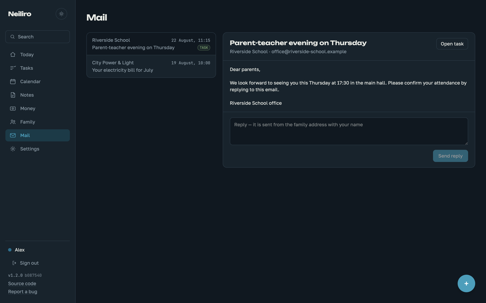

The household paperwork inbox — deliberately **not an email client**. One
shared address for the letters a family actually manages together: school,
utilities, bookings, insurance. Everyone sees the same inbox; opening a
letter marks it read for the whole family — a household desk has one
"handled" state, not a per-person one.

Where the letters come from depends on where the hub runs. **Self-hosted**,
it polls an external mailbox over IMAP (any provider; a dedicated mailbox
is best, a personal Gmail works via a filter into a separate label — the
hub reads only the configured folder and never touches personal mail).
**On a hosted hub** the address comes with the family: `<family>@<mail
domain>`, shown in Settings, fed by an inbound webhook, with nothing to
connect and no password to store. Both paths end in the same ingest
function, so everything below works identically. Setup:
[family-mail.md](family-mail.md).

A letter becomes a task in one click; the task lands in the Inbox project
and links back to the message. Attachments ride the regular attachments
pipeline and storage budget.

Replies always go out **from the family address** — the member's name
travels in the display name and is recorded in the hub. A connected
mailbox sends through its own SMTP; a service-issued address sends over
the provider's HTTP API, which is not a detail of taste: cloud hosts
routinely block outbound SMTP ports, and a reply path that depends on
them breaks on the next provider. Replies to your reply land back in the family
mailbox, so the whole thread stays in one place. There is no
compose-from-scratch: a paperwork desk answers letters, it does not
start correspondence.

v1 renders the plain-text part of a message; HTML rendering, ICS invites
into the calendar and invoice-to-transaction are tracked in the
[family mail epic](https://github.com/neiliro/neiliro/issues/30).

## Money

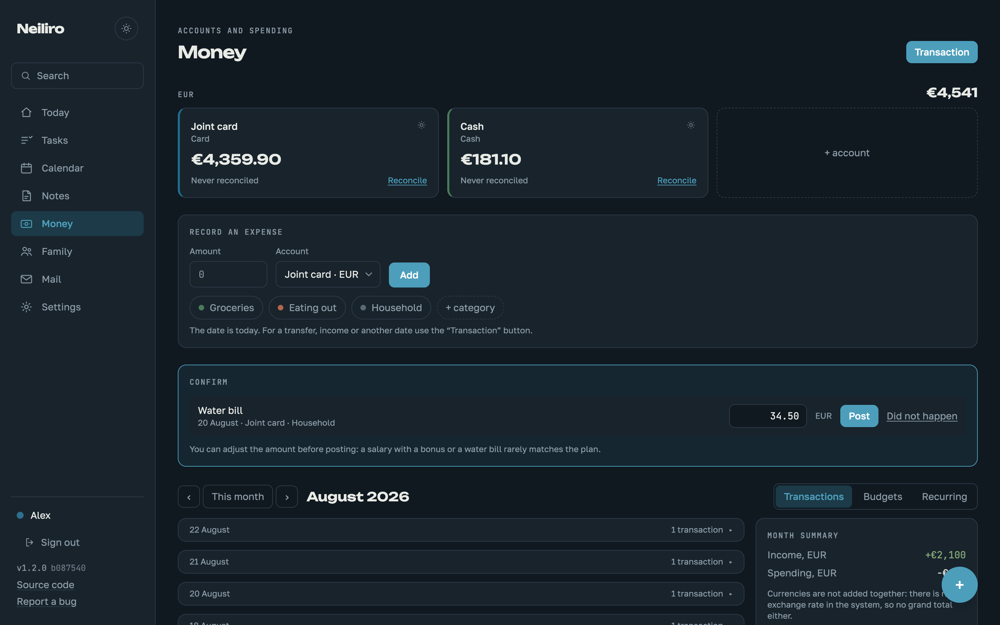

Amounts are stored as integers in minor units: 1234.56 → 123456. Floating point in money produces rounding errors that accumulate in sums and eventually disagree with the bank.

Currency lives on the account, and currencies are unrelated: no exchange rate, no grand total, summing happens strictly within one currency. A transfer between accounts in different currencies records two amounts — what left and what arrived.

Common currencies (EUR, RSD, USD, GBP, CHF, PLN, CZK, SEK, HUF) are one click when creating an account; any other ISO 4217 code can be typed in — the server accepts any, Intl formats it. The default currency for new accounts is a hub setting.

Balances are computed, not stored: opening balance plus movements. A stored balance drifts from history after any backdated edit.

Privacy is attached to the account, not the transaction. An account is shared or personal; a personal account's transactions and balance are visible only to the owner. There is no separate "hidden expense" flag, and thanks to that the shared account's balance is identical for everyone — there are no hidden withdrawals from it. A transfer from a shared account to a personal one is visible to the other person as an amount, without the account name or details: money leaving a shared account cannot be hidden, or the balance would be wrong. The free-text note on such a transfer stays visible along with the amount — it is part of the shared account's transaction, not of the masked destination. Write the details you want private in the personal account's own records, not in the transfer note.

A category with history is hidden, not deleted — otherwise past reports would lose their labels.

### Subcategories

A category can belong to a parent: "Car → Fuel, Parking, Service". The hierarchy is exactly one level deep by design — an arbitrary tree turns every report into recursion, while a family needs a "group → item" pair at most. The server enforces the depth: a subcategory cannot become a parent, and a category with children cannot become a subcategory.

In the month summary subcategories roll up into the parent — its row expands on click into the breakdown, with the parent's own transactions shown as a remainder. The pie chart shows the rolled-up shares, one chart per currency (shares across currencies are meaningless without an exchange rate). Deleting a parent promotes its children to the top level instead of dropping them: transaction labels are worth more than the hierarchy.

### Reconciliation

You enter the actual balance from the bank, the app shows the discrepancy. Without it, balance-based accounting falls apart — one missed expense breaks the number. One reconciliation per day: a repeat on the same day updates the previous one instead of adding a twin — what matters is the actual balance on a date, not the history of attempts to enter it.

The discrepancy is computed against the balance **at the moment of reconciliation**, not the current one: transactions recorded after the check do not shift it — the bank will process them too, there is nothing to compare them against. "At the moment" means transactions of earlier dates plus same-day transactions entered before the check. Both sides of the comparison are computed, not stored, so a missed expense entered retroactively recalculates the checked balance and closes the discrepancy — exactly the workflow reconciliation exists for: see a discrepancy, find what was forgotten, enter it, watch it match.

### Budgets

A budget is set per "category + currency" pair. A standing one applies every month; a single-month exception overrides it in that month only.

A budget on a parent category also counts its subcategories' spending: "Car" is fuel, parking and service together. A separate budget on a subcategory is still possible; the two coexist.

### Recurring transactions

A rule is a template, not a history record. What is due is computed by subtraction: all rule dates up to today, minus already-created transactions, minus manually skipped ones. No "next date" cursor is stored — it drifts after a backdated rule edit, while subtraction always gives the same answer.

A unique index on "rule + occurrence date" makes creation idempotent: a repeated run never doubles the rent.

`auto_create = 1` — created automatically (rent: charged on schedule). `auto_create = 0` — lands in the "Confirm" panel, where the amount can be adjusted before posting. Salary defaults to confirmation: it arrives late, and recording it ahead of time would skew the balance exactly when someone is looking at it.

Auto-creation catches up at server startup: the machine may have slept through a date or two.

### Receipts

Attached to a transaction with the same machinery as note attachments. The image is downscaled client-side to 1600 px on the long edge: a phone photo weighs megabytes, and all a receipt needs to show is the amount and the date.

## The Today board

The home screen is a board of widgets: the goal board (a countdown and
a savings bar), the agenda, a mini month, the balance, a money pulse,
reminders and recent notes.

The **goal** is whatever the family is heading towards — a move, a trip,
a bike. Give it a date and it counts the days down; give it a target
amount and it draws a bar, with the saved amount typed on the board
itself. Zero as the target means no money half at all — a plain
countdown, small enough to sit in a quarter of the row. The gear in its
corner leads to the rest of the fields, and with neither a date nor a
target the widget is simply not there.

The **agenda** is the week in one card — overdue, then today (events
with times and tasks together), then only the days ahead that actually
hold something. An empty day is silence, not an empty panel. A task
wears a checkbox — tickable right on the board — an event its
calendar-coloured dot. At full row width the card splits in two — the
now (overdue and today) beside the week ahead. Today's rows unfold
there: the description in full, the project or calendar, who a task is
on. The week ahead stays terse — a whole week of detail is noise. The **mini
month** marks days with dots in calendar colours; a day click opens the
calendar there. The **balance** answers the question the accounts screen
answers badly — not how much is there, but how much of it is already
spoken for: the spendable total, the wait for the next scheduled income,
and the standing payments that fall in between, with what is left after
them. One block per currency, nothing converted; a piggy bank stays out
of it, and so does a transfer that only moves money between spendable
accounts. The window opens a week back — a late salary and an unpaid
bill are still ahead of you, while older unconfirmed occurrences belong
to the pending list in Money. A payment whose day has come can be ticked
off right there — one click posts it at the planned amount, the same
confirmation the pending list does; an amount that turned out different
is a trip to Money. The remainder does not move when a bill is posted:
the money leaves the balance and the list at once. The **money pulse** shows this month's spending per
currency with the three heaviest categories (subcategories roll up into
their parent, same as the Money summary). A widget with nothing to say
renders nothing.

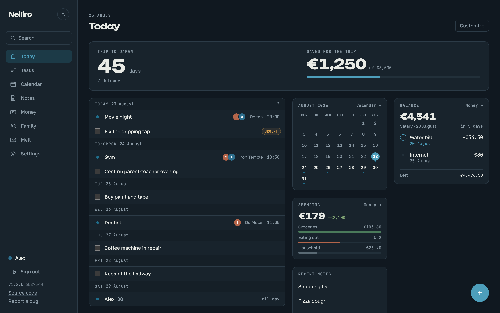

**Customize** turns the board editable: every widget grows a strip with
a handle to drag it anywhere. The column you drop it in is where it
stays; vertically widgets fall up like gravity, so a hole left by
something moved away closes itself. The same strip switches the
widget's width — a quarter of the row, a half or the whole thing — and
hides the widget; anything off the board comes back through the "Add
widget" tile below. While dragging, a dashed box shows the exact spot
the widget will land in, because the board packs the hypothetical
layout for real rather than guessing.

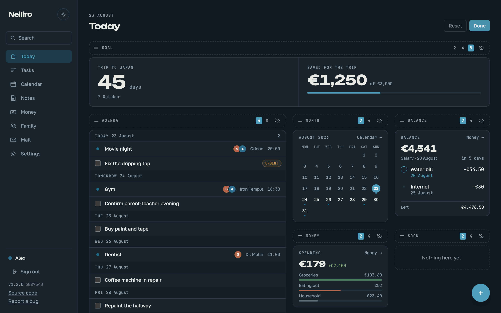

The layout is a per-device setting, like the calendar view and the
language: the hallway kiosk wants a big month at a glance, the phone
wants the agenda first, and a shared setting would make them fight.
"Reset" restores the default arrangement.

## Interface

<table>
  <tr>
    <td width="33%">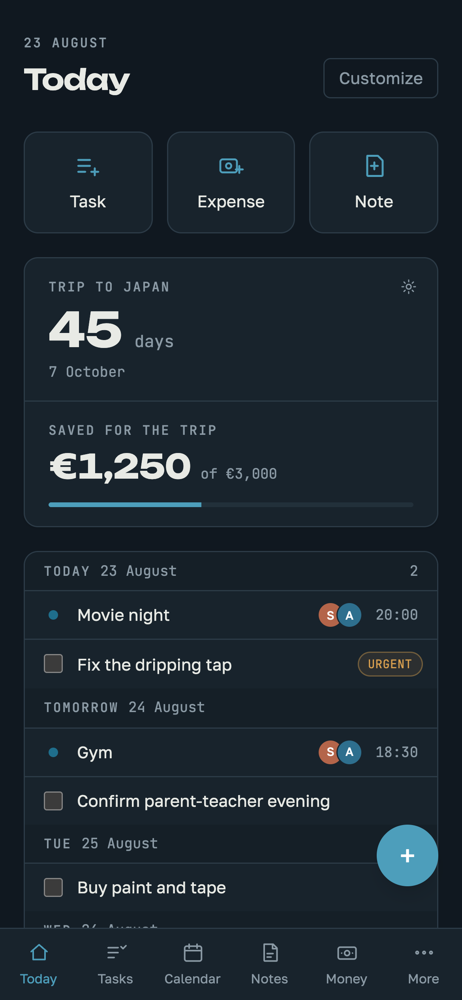</td>
    <td width="33%">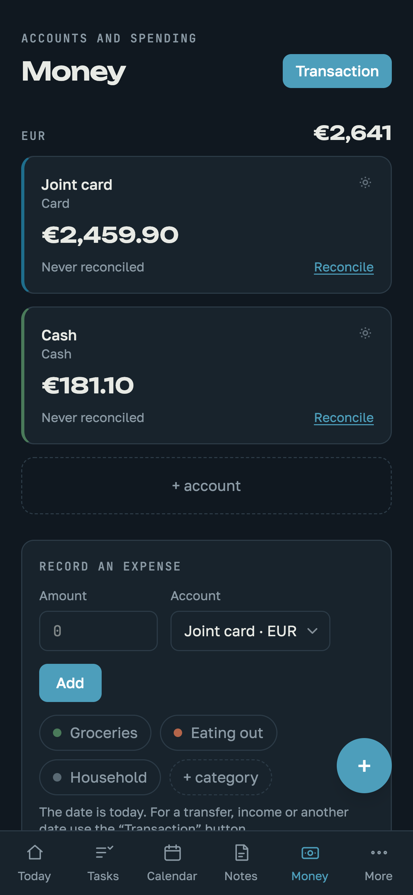</td>
    <td width="33%">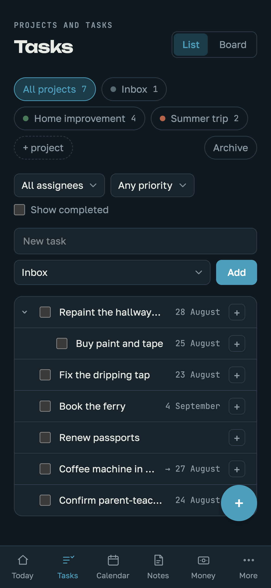</td>
  </tr>
</table>

Enter in any dialog performs the primary action — save, confirm, add — regardless of where the focus is. In a multi-line field Enter stays a line break; on a button it presses that button. Escape closes. One rule for every window: task card, event, transaction, budget, confirmations.

On a phone the main screen starts with three quick actions: task, expense, note. A phone is pulled out to record something on the go — these three buttons do it in one tap. The task one opens the same quick-add as `Cmd/Ctrl + K`, the expense one opens the transaction form, the note is created and opened immediately. Wide screens do not show the block: they have hotkeys and section buttons.

The sidebar does not scroll with the content: on a long task list the sections stay put, the panel has its own scroll.

"All projects" shows a total open-task counter — the same one each project has individually.

The interface speaks whichever of its languages your browser asks for — English and Russian today — and Settings has the switch when you want the other one. The first day of the week (Monday or Sunday) is configurable there too. Both are per-device settings: a phone and the shared kiosk can differ.

The hub also answers to a name of your own: Settings → **Home name** replaces "Neiliro" in the sidebar, on the sign-in screen and in the browser tab. Unlike the language and the first weekday it belongs to the household, not to the device — everyone sees it. It is a label, never an address: two families may both call themselves "Home". On the hosted service the public sign-in screen keeps saying Neiliro — a chosen name is the family's own business, and a renamed family has to stay indistinguishable from a subdomain that does not exist.

On the hosted service the family also has an **address** — the subdomain, `smiths-a1b2.neiliro.com`. The suffix is there so no two families collide, and the family gets one chance to drop it: for 24 hours after setting up the hub, the administrator can change the address once, from Settings → **Hub address** (the hub offers this at the first sign-in, too). It is one move because everything follows the address — everyone signs in again at the new one, the family mail address changes with it, old links stop working — and the old name is retired rather than handed to the next family. Once the day has passed or the address has been changed, the card disappears: the address is permanent.
