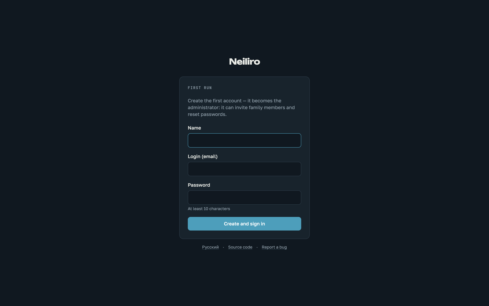

# Running on a home server

Everything about the hub living on a machine in your own network: HTTPS,
the `.local` name, updates, backups and moving between machines. For a
VPS with a real domain, see [deploy-vps.md](deploy-vps.md) instead.

## Starting

```bash
cp .env.example .env
docker compose up -d --build
```

The hub comes up on `http://localhost:8787` and is reachable from other devices on the network by the machine's address. The port is exposed directly so everything works without HTTPS.

An empty database offers to create the first account — that one becomes the administrator:



## HTTPS

Browsers require HTTPS for secure session cookies, and installing the hub to a phone's home screen (it is a PWA) needs it as well:

```bash
./scripts/setup-https.sh                  # name, certificate, hints
docker compose --profile https up -d      # start Caddy
```

Caddy lives in a separate profile deliberately: it will not start without a certificate, and the certificate only appears after `setup-https.sh`. Starting it together with everything else would mean a broken first run on a clean machine.

After that the hub opens at `https://hub.local` — **no port needed**, Caddy listens on 443 and redirects 80 to https. You can then set `SECURE_COOKIES=true` in `.env`.

## The name on the local network

The `.local` domain is served by Bonjour, and it answers **only to the machine's own name**. An arbitrary name like `hub.local` will not resolve by itself — not on the host, not on an iPad. Editing `/etc/hosts` helps only the machine where it was edited; it is useless for iPads and phones, because iOS has no hosts file.

So the hub's name must match the machine's network name. Check the current one (macOS):

```bash
scutil --get LocalHostName
```

Then either rename the machine — `hub.local` will then work on every device at once:

```bash
sudo scutil --set LocalHostName hub
```

or use the name the machine already has, putting it into `.env`:

```
HUB_HOST=machine-name.local
```

`setup-https.sh` checks this itself, warns, and offers to rename. The name goes into `.env`, and Caddy reads it from there — no manual config editing.

## Updating

Unpack the new version over the old one, replacing files, then rebuild:

```bash
docker compose up -d --build
```

(or `npm install && npm run dev` when running without Docker — dependencies change often).

The data folder is untouched by updates: users, passwords and content stay in place, initial setup is never needed twice. Migrations apply themselves at startup. On the first start of a new version, data from a legacy `./data` folder, if present, migrates automatically.

In development the server restarts itself — both backend and frontend watch files. A manual restart is only needed after `npm install`.

## Operations

The machine should wake up for the morning (macOS):

```bash
sudo pmset repeat wakeorpoweron MTWRFSU 06:30:00
```

Nightly backup at 03:00 — a database snapshot, notes exported to markdown, `age` encryption, a push to a private repository:

```bash
crontab -e
0 3 * * * cd /path/to/neiliro && AGE_RECIPIENT=age1... ./scripts/backup.sh
```

Attachments do not go to git — a machine-level backup (e.g. Time Machine) covers them.

Once a quarter, unpack a backup into a separate folder and make sure it opens. A backup that has never been restored is a backup only nominally.

## Moving to another machine

On the old machine:

```bash
npm run export -- ~/Desktop
```

This produces `neiliro-YYYY-MM-DD.tar.gz`: the database, attachments and a manifest. No need to stop the server — the database is exported via `VACUUM INTO`, i.e. opened as a database rather than copied as a file. A plain copy of `hub.db` would lose fresh writes: they live in the WAL journal next to it.

Transfer the archive however you like. It contains everything, private notes and personal accounts included.

On the new machine:

```bash
npm install
npm run import -- ~/Downloads/neiliro-2026-08-03.tar.gz
npm run dev
```

Before swapping anything, the import verifies database integrity and checks the contents against the manifest — a corrupted database is better not installed at all. If the new machine already has data, the import refuses and suggests `--force`; the previous database is not deleted but set aside as `hub-before-import-DATE.db`.

Passwords, accounts and content move wholesale; initial setup is never needed twice. Separately on the new machine you will need: its own certificate (`./scripts/setup-https.sh` — each machine has its own local CA), the `.env` if there was one, and the `pmset` wake schedule if you use one.

### Intel Macs

The project runs on them with no performance caveats: Node 22 and `better-sqlite3` build for x64, Rosetta is not needed. macOS 11 or newer is required. If a prebuilt `better-sqlite3` for the system is unavailable, Xcode tools are needed: `xcode-select --install`.
